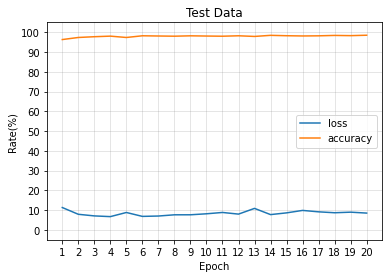
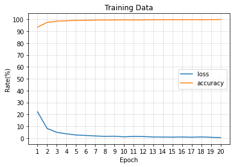
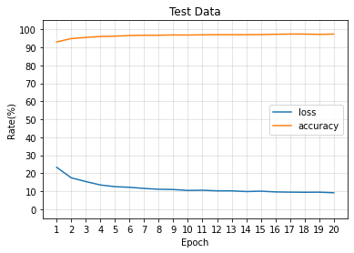
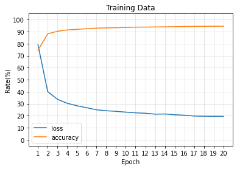

# MNIST without Drop-out

### Importing packages
    - We only need these more additional package 


```python
from keras.datasets import mnist
from keras.models import Sequential, load_model
from keras.layers.core import Dense, Dropout, Activation
from keras.utils import np_utils
```

    Using TensorFlow backend.


### Initializations and Loadings the data.


```python
# Load data from keras.
(X_train, y_train), (X_test, y_test) = mnist.load_data()
```


```python
# Reshaping and Flattening the data.

X_train = X_train.reshape(60000, 784)
X_test = X_test.reshape(10000, 784)
X_train = X_train.astype('float32')
X_test = X_test.astype('float32')

X_train /= 255
X_test /= 255
```


```python
# Using one-hot coding 

n_classes = 10
print("Shape before one-hot encoding: ", y_train.shape)
Y_train = np_utils.to_categorical(y_train, n_classes)
Y_test = np_utils.to_categorical(y_test, n_classes)
print("Shape after one-hot encoding: ", Y_train.shape)
```

    Shape before one-hot encoding:  (60000,)
    Shape after one-hot encoding:  (60000, 10)


### Constructing the model using Keras framework


```python
# Building the model network.

model = Sequential()
model.add(Dense(512, input_shape=(784,)))
model.add(Activation('relu'))                            

model.add(Dense(512))
model.add(Activation('relu'))

model.add(Dense(10))
model.add(Activation('softmax'))
```


```python
# Compiling the model.

model.compile(loss='categorical_crossentropy', metrics=['accuracy'], optimizer='adam')

# I could use Stochastic Gradient Descent or Adam optimizer, which adam in faster
```

### Fitting the data to the model and trainning.


```python
# training the model and saving metrics in history

history = model.fit(X_train, Y_train,
          batch_size=128, epochs=20,
          verbose=2,
          validation_data=(X_test, Y_test))
```

    Train on 60000 samples, validate on 10000 samples
    Epoch 1/20
     - 5s - loss: 0.2223 - accuracy: 0.9344 - val_loss: 0.1132 - val_accuracy: 0.9630
    Epoch 2/20
     - 4s - loss: 0.0814 - accuracy: 0.9742 - val_loss: 0.0791 - val_accuracy: 0.9735
    Epoch 3/20
     - 3s - loss: 0.0488 - accuracy: 0.9851 - val_loss: 0.0709 - val_accuracy: 0.9774
    Epoch 4/20
     - 3s - loss: 0.0360 - accuracy: 0.9878 - val_loss: 0.0673 - val_accuracy: 0.9803
    Epoch 5/20
     - 3s - loss: 0.0262 - accuracy: 0.9915 - val_loss: 0.0882 - val_accuracy: 0.9735
    Epoch 6/20
     - 3s - loss: 0.0224 - accuracy: 0.9928 - val_loss: 0.0684 - val_accuracy: 0.9821
    Epoch 7/20
     - 3s - loss: 0.0182 - accuracy: 0.9942 - val_loss: 0.0703 - val_accuracy: 0.9810
    Epoch 8/20
     - 3s - loss: 0.0148 - accuracy: 0.9948 - val_loss: 0.0764 - val_accuracy: 0.9800
    Epoch 9/20
     - 3s - loss: 0.0160 - accuracy: 0.9947 - val_loss: 0.0765 - val_accuracy: 0.9819
    Epoch 10/20
     - 3s - loss: 0.0112 - accuracy: 0.9962 - val_loss: 0.0816 - val_accuracy: 0.9808
    Epoch 11/20
     - 3s - loss: 0.0144 - accuracy: 0.9950 - val_loss: 0.0883 - val_accuracy: 0.9799
    Epoch 12/20
     - 3s - loss: 0.0134 - accuracy: 0.9955 - val_loss: 0.0800 - val_accuracy: 0.9821
    Epoch 13/20
     - 3s - loss: 0.0095 - accuracy: 0.9968 - val_loss: 0.1089 - val_accuracy: 0.9788
    Epoch 14/20
     - 3s - loss: 0.0090 - accuracy: 0.9970 - val_loss: 0.0775 - val_accuracy: 0.9843
    Epoch 15/20
     - 3s - loss: 0.0081 - accuracy: 0.9974 - val_loss: 0.0863 - val_accuracy: 0.9824
    Epoch 16/20
     - 3s - loss: 0.0096 - accuracy: 0.9970 - val_loss: 0.0986 - val_accuracy: 0.9812
    Epoch 17/20
     - 3s - loss: 0.0076 - accuracy: 0.9976 - val_loss: 0.0915 - val_accuracy: 0.9819
    Epoch 18/20
     - 3s - loss: 0.0099 - accuracy: 0.9968 - val_loss: 0.0868 - val_accuracy: 0.9839
    Epoch 19/20
     - 3s - loss: 0.0071 - accuracy: 0.9975 - val_loss: 0.0898 - val_accuracy: 0.9828
    Epoch 20/20
     - 3s - loss: 0.0044 - accuracy: 0.9985 - val_loss: 0.0852 - val_accuracy: 0.9849


### Plotting the results


```python
# plotting the metrics
fig, ax = plt.subplots()
x = range(1,len(history.history['loss'])+1)
y = range(0,101,10)
ax.grid(color='gray', alpha=0.25)
ax.set_axisbelow(True)
plt.title("Test Data")
plt.xlabel("Epoch")
plt.ylabel("Rate(%)")
plt.xticks(x)
plt.yticks(y)
plt.ylim(-5,105)
ax.plot(x,100*np.array(history.history['val_loss']), label= 'loss')
ax.plot(x,100*np.array(history.history['val_accuracy']), label='accuracy')
ax.legend()
plt.show()
fig, ax = plt.subplots()
ax.grid(color='gray', alpha=0.25)
ax.set_axisbelow(True)
plt.title("Training Data")
plt.xlabel("Epoch")
plt.ylabel("Rate(%)")
plt.xticks(x)
plt.yticks(y)
plt.ylim(-5,105)
ax.plot(x,100*np.array(history.history['loss']), label= 'loss')
ax.plot(x,100*np.array(history.history['accuracy']), label='accuracy')
ax.legend()
plt.show()
```








# MNIST with Drop-out

### changing the model to use dropout.


```python
model = Sequential()
model.add(Dense(512, input_shape=(784,)))
model.add(Activation('relu'))                            
model.add(Dropout(0.8))

model.add(Dense(512))
model.add(Activation('relu'))
model.add(Dropout(0.8))

model.add(Dense(10))
model.add(Activation('softmax'))
```

    WARNING:tensorflow:Large dropout rate: 0.8 (>0.5). In TensorFlow 2.x, dropout() uses dropout rate instead of keep_prob. Please ensure that this is intended.
    WARNING:tensorflow:Large dropout rate: 0.8 (>0.5). In TensorFlow 2.x, dropout() uses dropout rate instead of keep_prob. Please ensure that this is intended.


### Compiling and Fitting the data to model.


```python
# Compiling the model.

model.compile(loss='categorical_crossentropy', metrics=['accuracy'], optimizer='adam')
```


```python
# Fitting the model.

history = model.fit(X_train, Y_train,
          batch_size=128, epochs=20,
          verbose=2,
          validation_data=(X_test, Y_test))
```

    Train on 60000 samples, validate on 10000 samples
    Epoch 1/20
     - 4s - loss: 0.7917 - accuracy: 0.7451 - val_loss: 0.2331 - val_accuracy: 0.9299
    Epoch 2/20
     - 3s - loss: 0.4008 - accuracy: 0.8819 - val_loss: 0.1746 - val_accuracy: 0.9487
    Epoch 3/20
     - 3s - loss: 0.3370 - accuracy: 0.9030 - val_loss: 0.1539 - val_accuracy: 0.9551
    Epoch 4/20
     - 3s - loss: 0.3036 - accuracy: 0.9141 - val_loss: 0.1349 - val_accuracy: 0.9603
    Epoch 5/20
     - 3s - loss: 0.2832 - accuracy: 0.9190 - val_loss: 0.1253 - val_accuracy: 0.9622
    Epoch 6/20
     - 3s - loss: 0.2662 - accuracy: 0.9239 - val_loss: 0.1221 - val_accuracy: 0.9657
    Epoch 7/20
     - 3s - loss: 0.2495 - accuracy: 0.9291 - val_loss: 0.1156 - val_accuracy: 0.9672
    Epoch 8/20
     - 3s - loss: 0.2413 - accuracy: 0.9307 - val_loss: 0.1112 - val_accuracy: 0.9674
    Epoch 9/20
     - 3s - loss: 0.2365 - accuracy: 0.9326 - val_loss: 0.1096 - val_accuracy: 0.9688
    Epoch 10/20
     - 3s - loss: 0.2299 - accuracy: 0.9344 - val_loss: 0.1045 - val_accuracy: 0.9684
    Epoch 11/20
     - 3s - loss: 0.2242 - accuracy: 0.9370 - val_loss: 0.1056 - val_accuracy: 0.9696
    Epoch 12/20
     - 3s - loss: 0.2207 - accuracy: 0.9378 - val_loss: 0.1024 - val_accuracy: 0.9704
    Epoch 13/20
     - 3s - loss: 0.2131 - accuracy: 0.9390 - val_loss: 0.1023 - val_accuracy: 0.9701
    Epoch 14/20
     - 3s - loss: 0.2146 - accuracy: 0.9399 - val_loss: 0.0983 - val_accuracy: 0.9703
    Epoch 15/20
     - 3s - loss: 0.2084 - accuracy: 0.9413 - val_loss: 0.1004 - val_accuracy: 0.9710
    Epoch 16/20
     - 3s - loss: 0.2045 - accuracy: 0.9428 - val_loss: 0.0964 - val_accuracy: 0.9727
    Epoch 17/20
     - 3s - loss: 0.1976 - accuracy: 0.9434 - val_loss: 0.0951 - val_accuracy: 0.9738
    Epoch 18/20
     - 3s - loss: 0.1961 - accuracy: 0.9441 - val_loss: 0.0943 - val_accuracy: 0.9737
    Epoch 19/20
     - 3s - loss: 0.1955 - accuracy: 0.9446 - val_loss: 0.0949 - val_accuracy: 0.9722
    Epoch 20/20
     - 3s - loss: 0.1953 - accuracy: 0.9450 - val_loss: 0.0917 - val_accuracy: 0.9737


### Plotting the result


```python
# plotting the metrics

fig, ax = plt.subplots()
x = range(1,len(history.history['loss'])+1)
y = range(0,101,10)
ax.grid(color='gray', alpha=0.25)
ax.set_axisbelow(True)
plt.title("Test Data")
plt.xlabel("Epoch")
plt.ylabel("Rate(%)")
plt.xticks(x)
plt.yticks(y)
plt.ylim(-5,105)
ax.plot(x,100*np.array(history.history['val_loss']), label= 'loss')
ax.plot(x,100*np.array(history.history['val_accuracy']), label='accuracy')
ax.legend()
plt.show()
fig, ax = plt.subplots()
ax.grid(color='gray', alpha=0.25)
ax.set_axisbelow(True)
plt.title("Training Data")
plt.xlabel("Epoch")
plt.ylabel("Rate(%)")
plt.xticks(x)
plt.yticks(y)
plt.ylim(-5,105)
ax.plot(x,100*np.array(history.history['loss']), label= 'loss')
ax.plot(x,100*np.array(history.history['accuracy']), label='accuracy')
ax.legend()
plt.show()
```








### Explaination of Dropout
    - When using dropout, we turn neurons off by a keep_probs ratio, So the model is less likely to overfit the data,
    So difference between accuracy on test and trainning set would be smaller.
    Here I used a 80% dropout rate for example.
